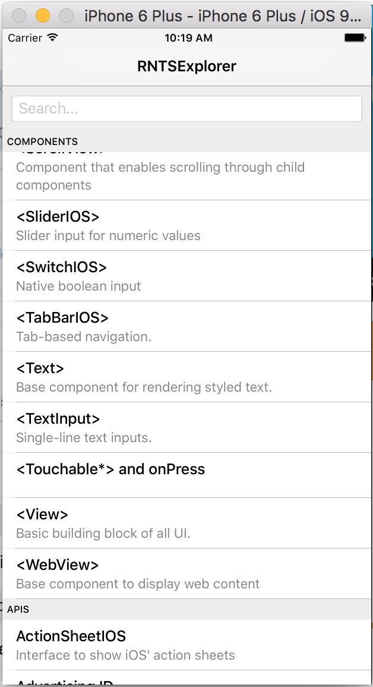

RNTSExplorer
============

React-Native UI Explorer written in Typescript.

React-native:

    . 0.14 for v1.0
    . 0.16 in trunk

This project is a port to Typescript of the original React Native UIExplorer that comes as part of the react-native distribution

The two main goals are to provide:

 - a testbed for the [react-native type definitions](https://github.com/DefinitelyTyped/DefinitelyTyped/tree/master/react-native) I am producing
 - copy/paste examples of React Native in Typescript

Requirements
------------

 - Xcode 7.1
 - Typescript 1.7.3 (1.6.2 for v1.0 - should work for trunk as well)
 - grunt-cli installed globally

 
Directories
-----------
 
  - `typescript`: the converted files
  - `gen`: the js generated from typescript - auto-created on transpilation
  - `js`: a couple of original, non converted files
 

Installing
----------

 1. Run `npm install` once to install various dependencies (`grunt-cli` must be installed globally)
 2. Run `grunt dev` to transpile the Typescript in JS
 3. Open the IOS project in Xcode (Android is untested at this stage) and run it

 
Building
--------
 
 Use `grunt dev` to compile or have your IDE output the JS to the `gen` folder.
 Make sure the target of the Typescript compiler is set to `es6`
 
 The RN server will automatically pick-up the new js as you edit the Typescript
 
 
License
-------
 
 See Facebook [license for examples](https://github.com/facebook/react-native/blob/master/LICENSE-examples) 